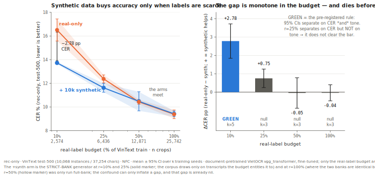
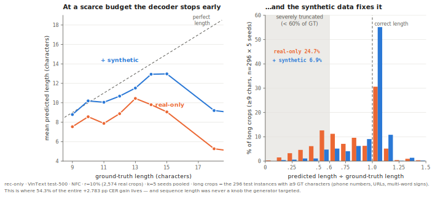
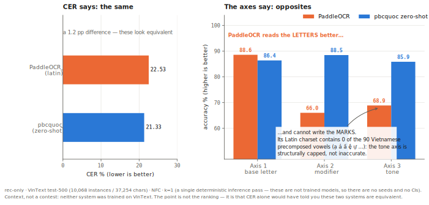

# Is synthetic data worth generating?

### A pre-registered study on Vietnamese scene-text OCR.

I built a synthetic data engine for Vietnamese scene text — fonts, corpus, degradation, background
compositing, the usual stack. **At full real data (25,742 crops) it is worth nothing**, including against
an augmentation-matched baseline: the control arm almost nobody runs. **At a 2,574-crop label budget it is
worth ≈2,200 real annotations** (rec-only CER 16.51 → 13.73, k=5 seeds, non-overlapping 95% CIs), decaying
to nil by 50% of the labels.

**And the machinery is not what paid.** The gain repairs premature decoder termination on long strings —
severe truncation falls from 24.7% to 6.9% — while the geometric stratum the engine was ordered around
carries 2.8% of it, not significantly. **Switching the entire degradation stack off recovers 94% of the
gain.** What the engine actually supplies is *sequence-level training signal*, not domain realism. If you
are label-poor, you need text of the right length distribution rendered legibly — not this.

This is not a paper and there is no new architecture in it. The contribution is epistemic: a
pre-registered, controlled, honestly-reported answer to a question practitioners actually face and
almost nobody tests — *is synthetic data worth generating, or should you just augment harder?*

<p align="center">
  
</p>

---

## TL;DR

1. **Full real data → synthetic buys 0.** ΔCER −0.038 pp, CIs overlap (k=3). This holds even against an
   augmentation-matched control arm (|Δ| < 0.17 pp on every metric).
2. **Scarce labels (10% of the train split) → synthetic ≈ 2,195 real crops** [95% range +1,678 …
   +2,553], and the value decays monotonically with the label budget: nil by 50%.
3. **The degradation stack contributed ~6% of the gain, not separable from zero.** The engine's own
   thesis is refuted by the engine's own measurements.

Every number on this page is **rec-only** (recognition given ground-truth boxes), on the **real VinText
test-500 held-out split** (10,068 instances / 37,254 characters, frozen denominator), **NFC-normalized**,
reported as **mean ± 95% CI over k training seeds**.

---

## What I measured it with

Vietnamese puts two orthogonal mark systems on one letter: a **modifier** (ă â ê ô ơ ư, and đ's stroke)
and a **tone** (á à ả ã ạ). A single CER — or even a single "diacritic accuracy" — cannot tell you which
one broke, and they break for different reasons. So the first thing I built was a **three-axis scorer**:
base letter / modifier / tone, each with its own denominator, scored on Levenshtein-aligned positions
after NFD decomposition.

On tone-stripped text (`tiếng Việt có dấu` → `tiêng Viêt co dâu`) it reports **CER 23.53% while the tone
axis is at 42.86%** and the base axis is a perfect 100%. Overall CER understates the tone damage by more
than double. That is the entire reason the three axes exist, and it is
[a unit test](test_vi_three_axis_scorer.py), not a claim.

Two Unicode facts the scorer is built around, both found by measuring rather than by reading the spec:

- **`đ`/`Đ` have no NFD decomposition.** If you treat the stroke as a combining mark you will never once
  observe it, and the modifier axis silently reports a perfect score on every `đ` in your corpus.
- **NFD returns combining marks in canonical order, not modifier-then-tone.** `ệ` decomposes to
  `e` + dot-below + circumflex — the *tone* comes first. Reading `nfd[1]` as "the modifier" mislabels
  `ệ`'s tone as a modifier: one axis is inflated, the other deflated, and the total still looks
  plausible.

The scorer is [a single dependency-free file](vi_three_axis_scorer.py) that works on anyone's Vietnamese
OCR output. It is the most reusable thing this project produced.

---

## The story

### Act 0 — The setup

A document-pretrained VietOCR recognizer (`vgg_transformer`, pbcquoc), 25,742 real VinText scene-text
crops, and one question: can synthetic data close what's left? The architecture was locked before any
code was written, precisely so that any accuracy gain could be attributed to the *data* rather than to a
stronger model. The [evaluation protocol](docs/EVAL_PROTOCOL.md) — metrics, normalization, splits, gate
thresholds — was frozen first, too. The git history shows the ordering.

Zero-shot, the document-pretrained checkpoint reads scene text at **21.33% CER**. Fine-tuned on the full
real train split it reaches **9.381% ± 0.368 CER** (k=3 seeds), tone axis **94.410% ± 0.281**. That
fine-tune is the vehicle, not the result. Everything after this is measured against it.

### Act 1 — My hypothesis died first

I predicted diacritics would dominate the error, and built the three-axis scorer to prove it. It refuted
me. Decomposing every character edit the baseline makes on the real test set:

| share of all character edits | |
|---|---|
| base-letter-only substitutions (case-insensitive) | **39.48%** |
| diacritic-only substitutions (tone or modifier wrong, base right) | **16.12%** |

**Base errors outweigh diacritic errors ~2.5×.** Three more pre-registered expectations died with it:
the canonical `hỏi`↔`ngã` tone confusion is essentially *absent* (4 instances each way — tone failure is
presence/absence, not confusion, which points at resolution and blur rather than mark similarity); the
horn (`ơ ư`) is the *most* accurate modifier class, not the predicted failure case; and tone does not
fall off a cliff at small sizes — *base* falls hardest.

But the instrument survived its own verdict. Tone is still the most fragile axis **per position**
(5.577% error vs base's 4.881%, case-insensitive) exactly as predicted — base positions simply outnumber
tone-bearing ones 2.5:1 (32,267 vs 12,875), so base contributes more total error. Both facts are true,
and **only the decomposition shows both**. A single CER shows neither.

The error analysis, not my intuition, then set the engine's priorities: geometric distortion (tilt ≥20°:
30.34% CER), photometric (contrast <0.20: 27.55%), resolution (height <12px: 22.86%). Font coverage — the
thing I had assumed would matter most — is a correctness prerequisite, not where the error lives.

### Act 2 — The gate said no

10,000 synthetic crops, generated to match the real crops' image statistics (a distribution audit passed
on all six stats before training), added on top of the full real train set. Everything else held fixed:
same hyperparameters, same 12,000 iterations, k=3 seeds.

| | baseline | + 10k synthetic | Δ |
|---|---|---|---|
| CER ↓ | 9.381 ± 0.368 | 9.521 ± 0.895 | **+0.140** (worse) |
| Axis 3 tone ↑ | 94.410 ± 0.281 | 94.374 ± 0.553 | −0.036 (flat) |

The pre-registered Gate-A condition — non-overlapping 95% CIs on **both** CER and tone — was written
before the baseline's seed variance was even measured. Neither metric separated. **RED.** And the
protocol's consequence for a red gate is not "try harder": it is *stop, do not scale to 200k*.

### Act 3 — First I suspected my code, not the world

Before touching the engine's design I ran the pre-declared bug-checks. One came back loud: I eyeballed 50
random synthetic crops against their labels and **~26% were degraded past legibility** — labels correct,
signal destroyed. I was training on noise. It also explained a specific signature: the synthetic arm's
seed variance was 2.4× the baseline's (±0.895 vs ±0.368), which is what unlearnable noise does.

I fixed the degradation stack (a per-crop severity budget: mild-or-hard, never every axis maxed at once).
Illegible crops fell from ~26% to ~6%. The predicted signature vanished exactly as predicted: **CER 95% CI
±0.895 → ±0.237**, now tighter than the baseline's own. Every axis flipped from negative to positive.

And it was still **RED**: ΔCER +0.038, CIs overlapping. The hygiene fix worked; it just didn't move the
result. Which is the honest and useful outcome — it means the red was never a bug.

### Act 4 — Then I suspected my comparator

Here is the arm almost nobody builds. My baseline was already running vietocr's default augmentation, so
I checked what that actually applies (measured from the installed package, not assumed): mild perspective,
motion blur, colour jitter, a dotted line. **No rotation, no shear, no Gaussian blur, no noise, no JPEG,
no resolution loss.** In other words the baseline was under-augmented *on exactly the strata I had
measured as the failure drivers* — which means a "+X% from synthetic" claim measured against it would
have been a strawman.

So I built three arms, k=3 seeds each, with **B and C sharing the identical augmentor** so that `C − B`
isolates the synthetic:

| | **A** baseline | **B** strata-aug, no synthetic | **C** strata-aug + 10k synthetic | **C − B** |
|---|---|---|---|---|
| CER ↓ | 9.381 ± 0.368 | 9.637 ± 0.074 | 9.620 ± 0.191 | **−0.017** |
| Axis 3 tone ↑ | 94.410 ± 0.281 | 94.542 ± 0.142 | 94.493 ± 0.117 | **−0.049** |

**At matched augmentation the synthetic contributed nothing.** Every metric moves by |Δ| < 0.17 pp with
every CI overlapping. Aggressive augmentation of *real* crops captures everything this synthetic engine
provides. A real crop degraded hard beats a rendered crop degraded hard.

There is a second, smaller finding hiding in that table, and it is worth stating because it cuts against
the "just augment harder" advice too. **B is not uniformly better than A**: strata augmentation improves
all three per-position axes (tone +0.132) while *worsening* CER (+0.256) and WER (+0.335). Decomposing
the edits shows the regression is **92% insertions**. Heavy augmentation makes the recognizer less willing
to drop a character and more willing to hallucinate one. It buys per-character robustness and pays in
hallucinated characters.

That is the full-data answer, and it is a null: **for a document-pretrained recognizer with 25.7k real
crops, generating the synthetic data was not worth it.**

### Act 5 — The pivot was pre-registered, not invented

The real-label-budget axis was reserved in the protocol *before* Gate A ran — it is the written branch for
exactly this outcome, not a post-hoc rescue. The question changes from "does synthetic add on top of all
my real data?" (answered: no) to **"how much real annotation can synthetic replace?"**

Same everything; only the real-label budget r varies, over fixed-seed nested subsets:

| r | n real | real-only CER | + synth CER | **ΔCER** | Δtone | pre-registered rule |
|---|---|---|---|---|---|---|
| **10%** | 2,574 | 16.509 ± 0.933 | **13.726 ± 0.096** | **+2.783** | **+2.033** | **GREEN** (k=5) |
| 25% | 6,436 | 12.373 ± 0.337 | 11.621 ± 0.374 | +0.752 | +0.515 | **red** — tone overlaps (k=3) |
| 50% | 12,871 | 10.430 ± 0.200 | 10.478 ± 0.807 | −0.047 | −0.013 | **null** (k=3) |
| 100% | 25,742 | 9.381 ± 0.368 | 9.419 ± 0.237 | −0.038 | +0.158 | **null** (k=3) |

**The gap is monotone in the budget.** Synthetic data substitutes for real labels, and only when real
labels are scarce.

### Act 6 — Then I attacked my own green, twice

**First attack: the corpus was cheating.** My generator drew 65% of its text from the VinText train
transcripts. But *transcripts are labels* — a practitioner at a 10% label budget does not have the other
90% of them. The eval firewall was intact (no test text anywhere), but the arm was using label-derived
text beyond its stated budget. I regenerated with a **strict bank** — the r-subset's own transcripts only
— and re-ran. Beyond-budget text among the synthetic labels fell from 37.0% to 11.0%, and I verified the
residual is not leakage (every remaining label is explained by the r-subset's own bank, free wiki_vi
tokens, or generated 1–2-char strings).

The result **split**. At r=10% the green survived at 84% of its original size (like-for-like at k=3, gap
+3.357 → +2.810; the k=5 re-run below lands it at +2.783). At r=25% it **died**: CER still separates (+0.752) but tone does not (+0.515, CIs overlap), and the
pre-registered rule requires both. The two-metric green dies somewhere in (10%, 25%]. That negative is
reported here at the same weight as the win, and the numbers in this repo's ledger were *corrected in
place* rather than quietly replaced — including a retraction of my own first over-reading of them.

**Second attack: more seeds.** The protocol pre-committed that k=5 numbers **replace** k=3 numbers
*regardless of direction* — which is the only condition under which adding seeds to a positive result is
honest rather than seed-shopping. It could have killed the green. It didn't: the means barely moved
(real-only −0.03, +synth −0.00) and the anchor's spread collapsed from ±2.350 to ±0.933 — the k=3 anchor
was under-sampled, not biased. The nearest CI edges (15.58 vs 13.82) sit **1.75 pp apart**. The separation
is not marginal.

**The headline, in full:** at a real-label budget of **2,574 crops** (10% of VinText train), adding 10k
crops from the synthetic engine cuts **rec-only CER on real VinText held-out from 16.509 ± 0.933 to
13.726 ± 0.096** (k=5 seeds, non-overlapping 95% CIs) and tone accuracy from 89.463 to 91.497 (+2.033 pp)
— **worth ≈ 2,195 additional real annotations** (95% range [+1,678 … +2,553], propagating both arms'
CIs). The effect decays monotonically with the real budget and **is nil at full real data.**

### Act 7 — And the mechanism isn't what I built

A curve without a mechanism is half a result, so I decomposed the +2.783 pp. The pre-stated fork: if the
gain concentrates on tone and on the small / low-contrast / tilted crops, the engine hit the failure
strata it was designed around. If it is broad and uniform, the synthetic is acting as a generic prior at
a scarce budget — a real gain, but a *different* mechanism, and the write-up has to say so.

It was the second one.

| stratum | ΔCER | share of the gain |
|---|---|---|
| **tilt ≥20°** — the #1 measured failure driver, the reason the geometric stack exists | **+1.60 ± 1.94** (does not clear noise) | **2.8%** |
| contrast <0.20 | +4.89 ± 2.97 | 8.4% |
| height <12px | +5.30 ± 2.47 | 18.3% |
| **length 9–12 chars** — never a targeted knob | **+16.79 ± 4.13** | **41.9%** |
| **length ≥13 chars** — never a targeted knob | **+17.66 ± 3.30** | **12.4%** |

**The stratum the engine was built for did not significantly improve.** Over half the gain lives in 296
long crops — phone numbers, URLs, multi-word signs — out of 10,068. So I looked at what the model actually
does to them:

<p align="center">
  
</p>

| long crops (≥9 chars, n=296, k=5) | mean GT length | mean predicted length | severely truncated (<60% of GT) |
|---|---|---|---|
| real-only (2,574 crops) | 11.19 | **8.37** | **24.7%** |
| + synthetic | 11.19 | **10.25** | **6.9%** |

```
GT            real-only      + synthetic
0583.871197 | 0587.87      | 0583.871197
0905.871198 | 09.87        | 0905.87198
0913.889124 | 09.88        | 0913.889124
```

At a 2,574-crop budget **the decoder terminates early** — it emits `<eos>` before finishing long strings,
losing about a quarter of the sequence. Adding 10k synthetic crops of almost *any* kind supplies the
decoder training signal that fixes premature termination. And because a deletion is wrong on every axis a
character bears, that single failure is also why all three axes rise together rather than tone alone.

So the honest causal story is **"at a scarce label budget, more crops of almost any kind fix decoder
under-training"** — not "my domain-realism machinery transferred." Which raised the obvious question, and
it had a pre-registered answer rule waiting for it.

#### Act 7, concluded — Then I switched the whole thing off

If the realism stack isn't what's paying, then rendering the same 10k crops with **the entire degradation
stack disabled** should cost me most of the gain. The rule was written before the control was generated:
**≥80% of the gain recovered ⇒ the realism machinery is not load-bearing; <50% ⇒ it is.**

Same corpus, same fonts, same strict bank, same generation seed. The two sets' label sets are *identical*
— only the pixels differ.

| arm (r=10%) | CER ↓ | tone ↑ | gain vs real-only |
|---|---|---|---|
| real-only (k=5) | 16.509 ± 0.933 | 89.463 ± 0.641 | — |
| + synthetic, **degradation ON** (k=5) | 13.726 ± 0.096 | 91.497 ± 0.134 | **+2.783** / +2.033 |
| + synthetic, **degradation OFF** (k=3) | 13.900 ± 0.155 | 91.231 ± 0.242 | **+2.609** / +1.768 |

**Clean renders bought 93.7% of the CER gain** (and 86.9% of the tone gain). Shipped-minus-clean is
**0.174 pp — not separable from zero**, CIs overlapping.

Three independent measurements had been pointing at the same thing, and I had been reading them one at a
time: the augmentation-matched control (a real crop degraded hard beats a rendered one), the stratum
decomposition (the geometric stratum carries 2.8% of the gain, not significantly), and now this ablation.
**The realism machinery was never the lever. The text was.**

The font-coverage gate, the degradation stack, the background compositing, the distribution audit — all of
it was built for a mechanism that is not the one operating. Pixel realism was ~6% of the gain and
unresolvable from noise. The text was ~94% of it.

**So the practical advice, for anyone about to build what I built: don't.** At a low label budget you do
not need an elaborate generator. You need **text of the right length distribution, rendered legibly.**
That is a far cheaper artifact than this one, and saying so is worth more than defending the machinery.

> **One scope limit, stated precisely, because "the entire degradation stack off" could be read too
> broadly.** The control switches off *the engine's* degradation stack (geometric, photometric, blur,
> JPEG — the heavy, strata-targeted stack). It does **not** make the crops pixel-pristine at training
> time: vietocr's default `image_aug` is applied by the training loader to **every** sample, real and
> synthetic alike, with no branch between them
> ([`trainer.py:80`](third_party/vietocr/vietocr/model/trainer.py) →
> [`dataloader.py:121`](third_party/vietocr/vietocr/loader/dataloader.py)) — so the clean crops still
> received mild perspective (0.01–0.05), a fixed 3-px motion blur, colour jitter and a dotted line, each
> at p ≤ 0.5. That floor is **identical in every arm**, so it is not a confound for the shipped-vs-clean
> comparison. But the honest claim is *"the engine's realism stack is not load-bearing **above a floor of
> generic mild augmentation**"* — not *"pixel realism is irrelevant from zero."* The latter was not
> tested and is not claimed.

---

## Results

Everything, one table. Scope is **rec-only** on **real VinText test-500** (10,068 instances / 37,254
chars), **NFC**, mean ± 95% CI over k seeds. Negative rows are not smaller or greyer than positive ones.

| # | arm | real crops | synthetic | k | **CER ↓** | **tone ↑** | verdict |
|---|---|---|---|---|---|---|---|
| 0 | zero-shot (no fine-tune) | 0 | 0 | 1 | 21.33 | 85.88 | (the domain gap) |
| 1 | **A — real-only baseline** | 25,742 | — | 3 | **9.381 ± 0.368** | **94.410 ± 0.281** | (the comparator) |
| 2 | + 10k synthetic (marginal-matched) | 25,742 | 10k | 3 | 9.521 ± 0.895 | 94.374 ± 0.553 | **RED** |
| 3 | + 10k synthetic (legibility-fixed) | 25,742 | 10k | 3 | 9.419 ± 0.237 | 94.568 ± 0.463 | **RED** |
| 4 | B — strata-aug, no synthetic | 25,742 | — | 3 | 9.637 ± 0.074 | 94.542 ± 0.142 | (the control) |
| 5 | C — strata-aug + strata-synthetic | 25,742 | 10k | 3 | 9.620 ± 0.191 | 94.493 ± 0.117 | **RED** (C−B ≈ 0) |
| 6 | real-only @ r=50% | 12,871 | — | 3 | 10.430 ± 0.200 | 93.869 ± 0.535 | |
| 7 | + synthetic @ r=50% | 12,871 | 10k | 3 | 10.478 ± 0.807 | 93.856 ± 0.408 | **null** |
| 8 | real-only @ r=25% | 6,436 | — | 3 | 12.373 ± 0.337 | 92.432 ± 0.357 | |
| 9 | + synthetic @ r=25% (strict bank) | 6,436 | 10k | 3 | 11.621 ± 0.374 | 92.948 ± 0.403 | **red** (tone overlaps) |
| 10 | **real-only @ r=10%** | 2,574 | — | 5 | **16.509 ± 0.933** | **89.463 ± 0.641** | |
| 11 | **+ synthetic @ r=10% (strict bank)** | 2,574 | 10k | 5 | **13.726 ± 0.096** | **91.497 ± 0.134** | **GREEN** |
| 12 | **+ clean-render synthetic @ r=10%** (degradation OFF) | 2,574 | 10k | 3 | **13.900 ± 0.155** | **91.231 ± 0.242** | **94% of the gain** |

Rows 2–5 are the product as much as row 11 is. Row 12 is what refutes the engine's own thesis.

**Detection.** An off-the-shelf English-pretrained detector scores **48.0% F1 @ IoU 0.5** on VinText
(probe, 20 images; input resolution ruled out as the cause). It is *not* this system's detector, and an
un-fine-tuned detector is a lower bound on detection quality — so the end-to-end gap it produces would be
an *upper* bound on detection-induced error, which is the wrong side for any decision. **No end-to-end
number is reported.** Producing one from that detector would have manufactured a large, false "detection
is the bottleneck" finding.

**Gold reference set** — `[PENDING]`. Public VinText labels contain annotation noise, so CER against them
measures model error *plus* label error, entangled. A 2,437-instance stratified gold subset is sampled,
crops are extracted through the eval's own code path, and the transcription tool is built and
smoke-tested — but **the manual double-pass is not done, so no noise-floor number exists and none is
claimed here.** When it lands it will be quoted as a **lower bound** ("public labels contain ≥ X%
disagreement"), with the blind-vs-assisted rate stated, because prefilling with the public label
undercounts noise.

The noise is real, though, and you can see it without the gold pass: the first test image's polygon
labelled `VỰ` demonstrably encloses **`VỰC`**. A model that reads it *correctly* is charged an error.
[`demo.py`](demo.py) rediscovers exactly this case on the first six crops it is handed.

### Context, not a contest

A reader cannot tell whether 9.4% CER is good without a yardstick, so I ran off-the-shelf Vietnamese OCR
on the **same test-500, at the same rec-only scope, scored by the same three-axis scorer** — recognition-only
mode enforced (feeding a word crop to a full detect-then-read pipeline and scoring its empty return would
be a strawman), with a 20-crop smoke test first to prove I was calling each system correctly (0/20 empty
returns). The protocol for this was [pre-registered and committed before the first run](docs/EVAL_PROTOCOL.md).

**These systems were not trained on VinText; mine was.** This table measures the *task's difficulty* and
demonstrates the scorer on systems that are not mine. It is not a superiority claim.

| system | CER ↓ | exact ↑ | base ↑ | modifier ↑ | tone ↑ |
|---|---|---|---|---|---|
| EasyOCR 1.7.2 (`vi`, latin_g2) | 38.46 | 37.95 | 68.11 | 74.02 | 72.75 |
| PaddleOCR 3.7.0 (`latin_PP-OCRv5_mobile_rec`) | 22.53 | 43.55 | **88.59** | **66.03** | **68.89** |
| Tesseract-vie | **[install failed](RESULTS.md)** — binary needs elevation; reported, not faked | | | | |
| pbcquoc `vgg_transformer`, **zero-shot** | 21.33 | 60.83 | 86.41 | 88.49 | 85.88 |
| **ours** @ r=10% (2,574 real + 10k synth) | 13.73 | — | — | — | 91.50 |
| **ours** @ full real data (25,742 crops) | **9.38** | 81.87 | 94.11 | 96.25 | 94.41 |

*(k=1 — single deterministic inference pass; these are not trained models, so there are no seeds and no CIs.)*

**And the scorer immediately found something a CER ranking would have buried.**

<p align="center">
  
</p>

PaddleOCR ships no Vietnamese recognizer; the nearest is its multilingual *latin* model. So I inspected its
output charset rather than reading its errors as accuracy: **all 90 of the 90 Vietnamese precomposed
characters (U+1EA0–U+1EF9: ạ ả ấ ầ ệ ự …) are absent from it.** It **cannot emit a toned vowel.** Its tone
axis is *structurally capped, not inaccurate* — and the measured confusions confirm it exactly
(`nang→ngang` 853, `huyen→ngang` 696, `sac→ngang` 616). It is not mistaking one tone for another; it is
unable to write one.

Now compare it with the zero-shot pbcquoc checkpoint. **Their CERs are nearly identical — 22.53 vs 21.33 —
and a CER-only leaderboard would call them equivalent.** They are opposites: PaddleOCR reads the *letters*
better (base 88.59 vs 86.41) and cannot write the *marks* (modifier 66.03 vs 88.49).

**This is the takeaway the scorer exists for, and it is the one I would actually use tomorrow:** *if you
are choosing an OCR engine for Vietnamese, CER will mislead you. It will not tell you that the engine
cannot represent the language.* You would have to decompose the error — or read the charset — to find that
out, and a leaderboard will never do either for you.

The honest reading of the gap between the rows is **not** "my method beats EasyOCR and PaddleOCR." It is
that **in-domain training data matters**, and that **an off-the-shelf multilingual model may not even
encode the language you are pointing it at** — which is the more useful warning of the two.

---

## What I'd do differently

- **I chose the operating point before I knew how much of the domain gap the real fine-tune already
  closed.** The document→scene gap is huge zero-shot (21.33% CER) and the real fine-tune closes most of it
  (9.38%). Synthetic data was always going to be fighting for the remainder. Measuring that first would
  have told me the full-data null was likely *before* I built the engine — and would have pointed me at
  the label-budget axis on day one, where the effect actually lives.
- **The degradation stack was organised around a stratum ranking that turned out not to drive the gain.**
  I ranked geometric distortion #1 from the error analysis, built the generator around it, and the
  geometric stratum contributed 2.8% of the eventual gain (not significant). The error analysis told me
  where the model *fails*; I assumed that was the same as where synthetic data *helps*. It isn't.
- **One subset draw per budget point.** The curve carries training-seed variance only; **subset-draw
  variance is unquantified.** This is standard for label-efficiency curves and it is still a real
  limitation, so it is stated rather than buried.
- **I would have run the clean-render control first, not last.** It costs about an hour and it goes
  straight at the attribution question the entire engine rests on. Run at the start, it would have told me
  the degradation stack was not the lever *before* I spent the project building and defending one — and
  the honest version of this project would have been much smaller and just as informative.

## What this does not claim

- **Not an end-to-end promise.** Every headline number is **rec-only** (recognition given ground-truth
  boxes). Detection is deferred and its ceiling is unstated, deliberately (see above).
- **Not that synthetic data teaches Vietnamese.** The document-pretrained prior does. This measures what
  synthetic data adds *on top of* that prior, at a given real-label budget.
- **Not a curve beyond the measured budgets.** Four points (10/25/50/100%) on one dataset, one
  architecture, one 10k synthetic set. The "worth ≈2,195 real crops" readout is an interpolation
  *between measured points only*, never an extrapolation.
- **Not other languages, other datasets, or other architectures.** The architecture was locked so that the
  data could be the only variable; that lock is also the limit of the claim.
- **Not a claim that synthetic data is useless.** It is a claim that *this* engine, at *this* operating
  point, with *this* comparator, bought nothing at full data and bought ~2,200 labels' worth when labels
  were scarce — and that the reason it worked is not the reason I built it.

## The pre-registration

The protocol, the gates, the metric definitions, the attempt budget, and the branch that became Act 5
were all written in [`docs/`](docs/) **before the experiments they govern**, and the git history proves
the ordering. That is what makes the negatives above worth anything: a gate you can move after seeing the
result is not a gate.

- [`docs/CLAUDE.md`](docs/CLAUDE.md) — the anchor: locked decisions, firewalls, and the design bets, each
  with a kill-test. Several of them are refuted in this README.
- [`docs/EVAL_PROTOCOL.md`](docs/EVAL_PROTOCOL.md) — the ruler: metrics, scopes, the frozen denominator,
  the Gate-A condition, the k=5 pre-commitment, the budget axis, the clean-render control's readings.
- [`docs/DATA_ENGINE.md`](docs/DATA_ENGINE.md) — the generator's design, and the **budget of two re-gate
  attempts** that stops a red gate from being iterated into a green one.
- [`docs/ERROR_ANALYSIS.md`](docs/ERROR_ANALYSIS.md) · [`docs/SCALING.md`](docs/SCALING.md) ·
  [`docs/BUILD_PLAN.md`](docs/BUILD_PLAN.md) — the error-analysis spec, the curve protocol, the build log.
- [`RESULTS.md`](RESULTS.md) — the measured-evidence ledger. Every number above, with its provenance,
  including the ones that were retracted and corrected in place.

They are reproduced unedited, wrong predictions and all. Verify the ordering yourself:

```bash
git log --follow --format='%ad %s' --date=short -- docs/EVAL_PROTOCOL.md
git log --format='%ad %s' --date=short -- RESULTS.md
```

## How this was built

Design partner (a separate reasoning thread) + agentic implementation, with a hard rule: **the
implementation never adjudicates its own gate.** Every gate — Gate A, the strict-bank correction, the k=5
re-run, the mechanism fork, the clean-render control — was reported with its number and its provenance and
then *stopped*, and a separate pass ruled on it. That is why "RED" survived in this repo instead of
quietly becoming "promising." The manual gold transcription pass is the author's own work and is not
delegated to a model — a model-prefilled gold set inherits the model's errors and biases the comparison in
the one direction that would void the artifact.

---

## Reproducing it

VinText is licensed for research use and cannot be redistributed, so "clone and rerun the study" is not
something I can hand you. What *is* runnable stands alone:

**1. The three-axis scorer — no dataset, no dependencies, one file.**

```bash
python -m unittest test_vi_three_axis_scorer -v      # 26 tests, stdlib only
python vi_three_axis_scorer.py your_predictions.tsv --confusion
```

```python
from vi_three_axis_scorer import score

s = score([("giá", "gia"), ("Việt Nam", "Viet Nam")])   # (ground_truth, prediction)
print(s.report())
print(s.cer, s.tone_acc, s.base_acc)
```

Copy the file into your project. It works on any Vietnamese OCR system's output.

**2. The demo — any image, the shipped checkpoint, the three-axis breakdown.**

```bash
python demo.py crop.jpg --gt "Việt Nam"
python demo.py path/to/crops/ --gt-tsv labels.tsv --confusion
```

**3. The generator** runs without VinText (the corpus source, wiki_vi, is public; the font manifest and
its per-font diacritic-coverage gate are in `engine/`).

**4. The figures** rebuild from the run artifacts, not from hand-typed numbers:

```bash
python scripts/make_figures.py     # -> docs/figures/*.svg + *.png
```

**Environment.** RTX 4060 Laptop (8 GB), Python 3.13, torch 2.13+cu126. One training run ≈ 27 min. Every
result in `RESULTS.md` cites its script, config, seed, and data manifest.

---

*Vietnamese scene text · DBNet + VietOCR (`vgg_transformer`) · rec-only headline · VinText test-500 ·
NFC · three-axis diacritic scoring.*
